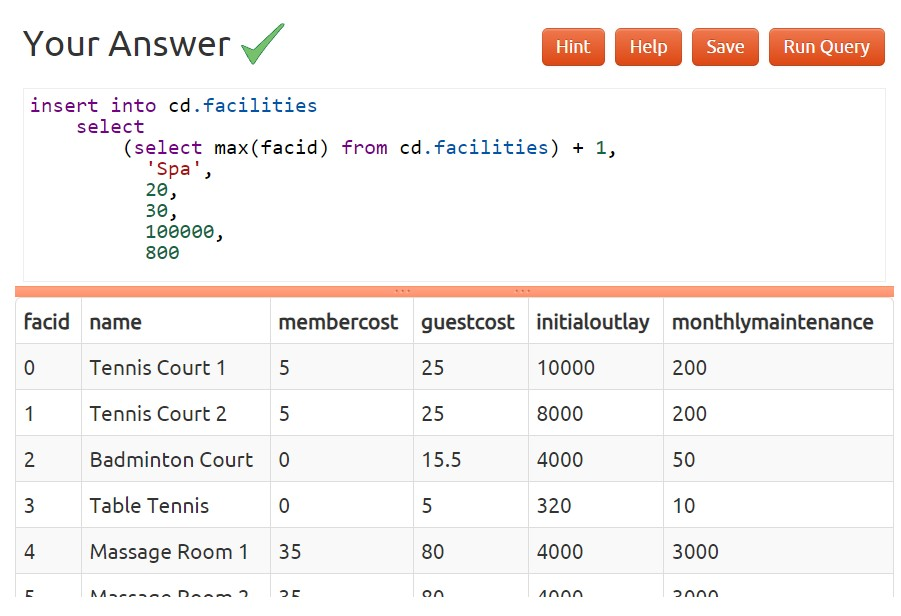

### 1)Insert some data into a table

### 2)Insert multiple rows of data into a table

### 3)Insert calculated data into a table

### 4)Update some existing data

### 5)Update multiple rows and columns at the same time

### 6)Update a row based on the contents of another row

### 7)Delete all bookings

### 8)Delete a member from the cd.members table

### 9)Delete based on a subquery
