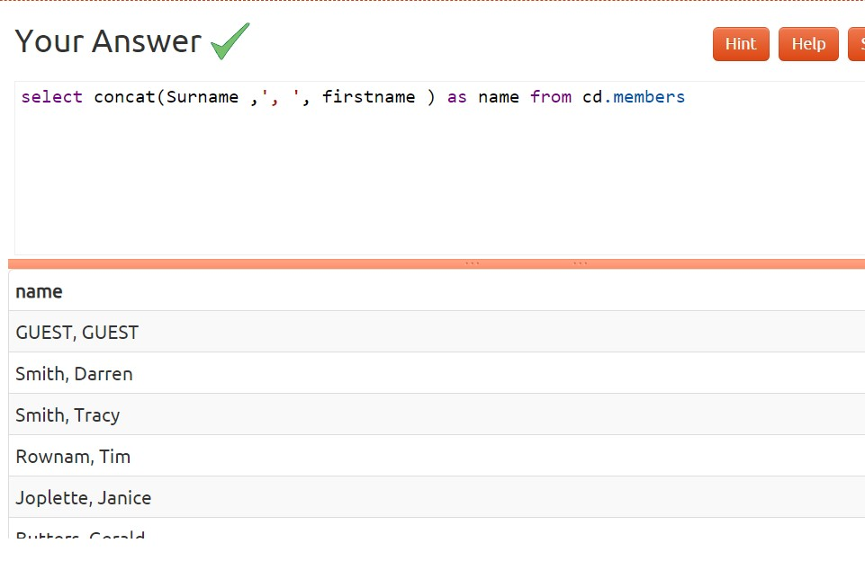
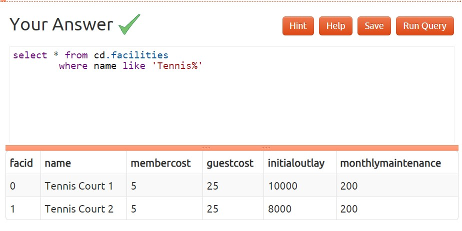
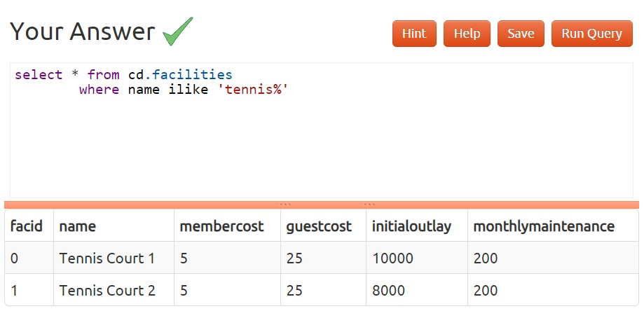
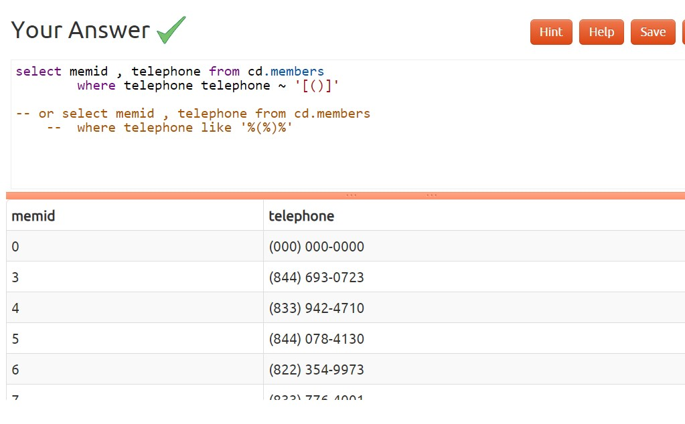
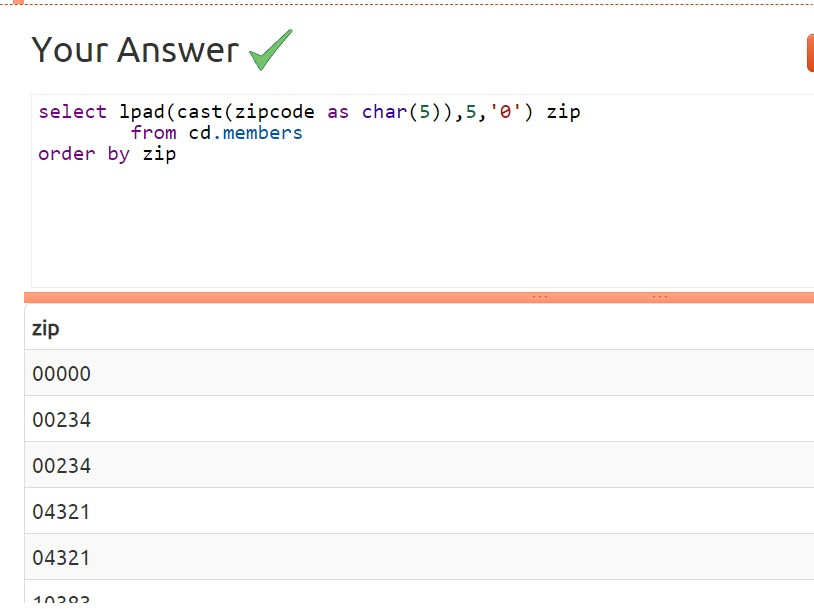
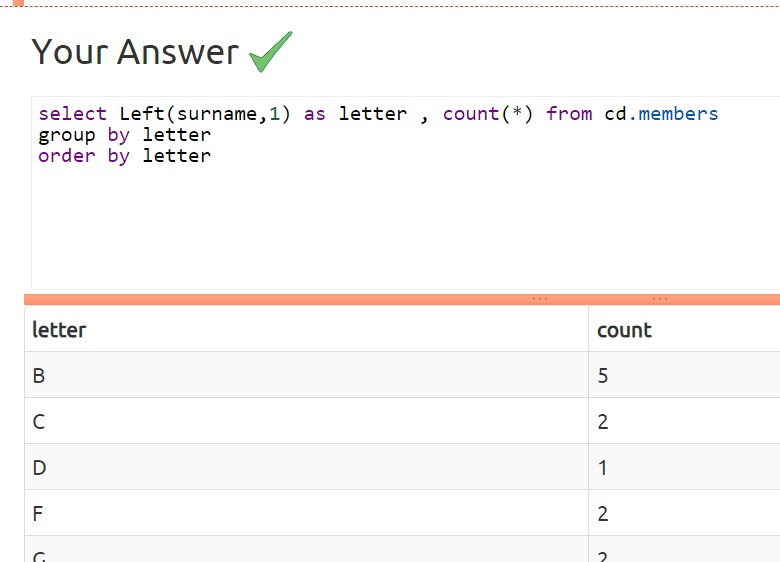
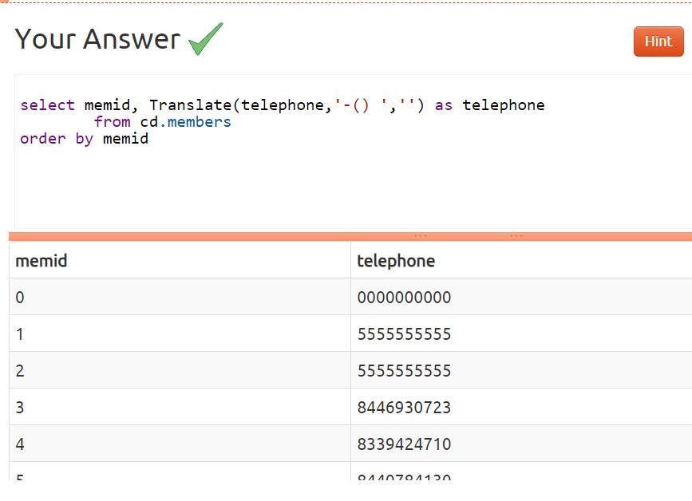

### 1)Format the names of members

### 2)Find facilities by a name prefix

### 3)Perform a case-insensitive search

### 4)Find telephone numbers with parentheses

### 5)Pad zip codes with leading zeroes

### 6)Count the number of members whose surname starts with each letter of the alphabet

### 7)Clean up telephone numbers
