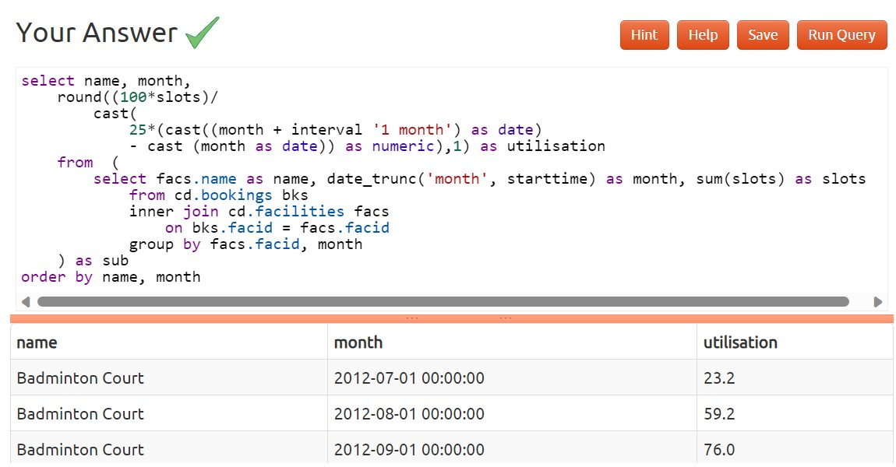

### 1)Produce a timestamp for 1 a.m. on the 31st of August 2012

### 2)Subtract timestamps from each other

### 3)Generate a list of all the dates in October 2012

### 4)Get the day of the month from a timestamp

### 5)Work out the number of seconds between timestamps

### 6)Work out the number of days in each month of 2012

### 7)Work out the number of days remaining in the month

### 8)Work out the end time of bookings

### 9)Return a count of bookings for each month

### 10)Work out the utilisation percentage for each facility by month
